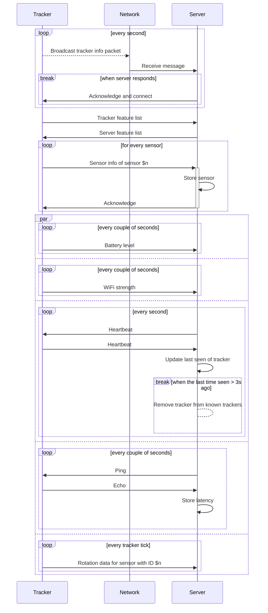

# Firmware protocol

Below you should/are able to see a sequence diagram of what packets are sent when:

```mermaid
sequenceDiagram
    loop every second
        Tracker-->>Network: Broadcast tracker info packet
        Network->>Server: Receive message

        break when server responds
            Server->>Tracker: Acknowledge and connect
        end
    end

    Tracker->>Server: Tracker feature list
    Server->>Tracker: Server feature list

    loop for every sensor
        Tracker->>+Server: Sensor info of sensor $n
        Server->>Server: Store sensor
        Server->>-Tracker: Acknowledge
    end

    par
        loop every couple of seconds
            Tracker->>Server: Battery level
        end
    and
        loop every couple of seconds
            Tracker->>Server: WiFi strength
        end
    and
        loop every second
            Server->>Tracker: Heartbeat
            Tracker->>Server: Heartbeat
            Server->>Server: Update last seen of tracker

            break when the last time seen > 3s ago
                Server-->Server: Remove tracker from known trackers
            end
        end
    and
        loop every couple of seconds
            Server->>Tracker: Ping
            Tracker->>Server: Echo
            Server->>Server: Store latency
        end
    and
        loop every tracker tick
            Tracker->>Server: Rotation data for sensor with ID $n
        end
    end
```